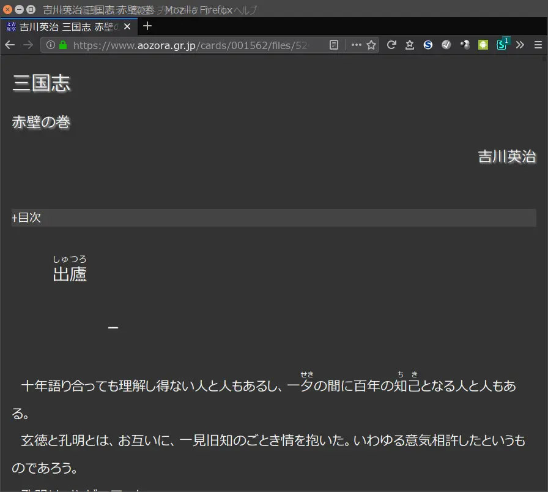
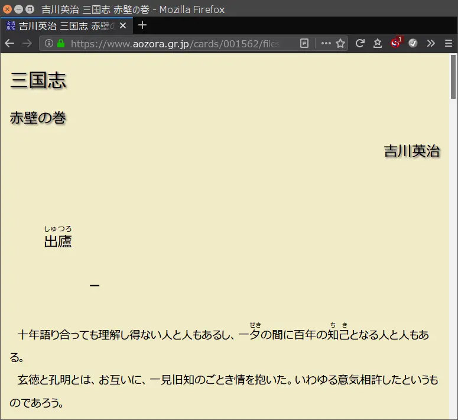

## UserCSS : 青空文庫ダークテーマ／ブラウンテーマCSS<!-- omit in toc -->

[Home](https://oasis3855.github.io/webpage/) > [Software](https://oasis3855.github.io/webpage/software/index.html) > [Software Download](https://oasis3855.github.io/webpage/software/software-download.html) > [userstyles](../README.md) > ***Aozorabunko*** (this page)

 
 

Last Updated : May. 2019

 
 

- [CSSのダウンロード](#cssのダウンロード)
  - [stylusで自動インストールする](#stylusで自動インストールする)
- [概要](#概要)
  - [ダークテーマ画面イメージ](#ダークテーマ画面イメージ)
  - [ブラウンテーマ画面イメージ](#ブラウンテーマ画面イメージ)
- [インストール方法](#インストール方法)
  - [自動インストール](#自動インストール)
  - [手動インストール](#手動インストール)
- [動作確認済み](#動作確認済み)
- [ライセンス](#ライセンス)

 
 

## CSSのダウンロード

-    [このGitHubリポジトリを参照する（ソースコード）](../Aozorabunko/) 

-    [UserStyles.org Archive
を参照する（GitHubに移動前の過去ソースコード）](https://uso.kkx.one/browse/styles?search=%40302719) 

### stylusで自動インストールする

stylus拡張機能がブラウザにインストールされている場合、次のCSSファイルへのURL（Rawデータ）を開くことで、自動インストール画面が表示される。

- ダークテーマ（[Aozorabunko_DarkTheme.user.css](https://raw.githubusercontent.com/oasis3855/userstyles/main/Aozorabunko/Aozorabunko_DarkTheme.user.css)）のインストール :  

- ブラウンテーマ（[Aozorabunko_BrownTheme.user.css](https://raw.githubusercontent.com/oasis3855/userstyles/main/Aozorabunko/Aozorabunko_BrownTheme.user.css)）のインストール :  

 
 

## 概要

[青空文庫](https://www.aozora.gr.jp/)の配色をダークテーマ（黒背景に白文字）、ブラウンテーマ（薄茶色背景に黒文字）に変更するstylus拡張機能用のCSSファイル

### ダークテーマ画面イメージ

### ブラウンテーマ画面イメージ

 
 

## インストール方法

Webブラウザにstylus拡張機能が必要

- chromeウエブストア : [stylus](https://chromewebstore.google.com/detail/stylus/clngdbkpkpeebahjckkjfobafhncgmne?hl=ja&pli=1)
- Firefox ADD-ONS : [stylus](https://addons.mozilla.org/ja/firefox/addon/styl-us/)

### 自動インストール

このページの「CSSのダウンロード」->「stylusで自動インストールする」セクションに記載せれている、CSSファイルへのURL（Rawデータ）をクリックすれば、stylus拡張機能のインストール画面が表示される。

 
 

### 手動インストール

stylusの管理画面で「スタイルを新規作成」した後、CSSを「インポート」画面に”テキスト貼り付け”して取り込む。

詳細は『[Userstyles 導入・作成メモ](../HowTo.md)』を参照。

 
 

## 動作確認済み

- Windows版 Edge（2024年2月時点）
- Android版 Firefox（2024年2月時点）

 
 

## ライセンス

このスクリプトは [GNU General Public License v3ライセンスで公開する](https://gpl.mhatta.org/gpl.ja.html) フリーソフトウエア
