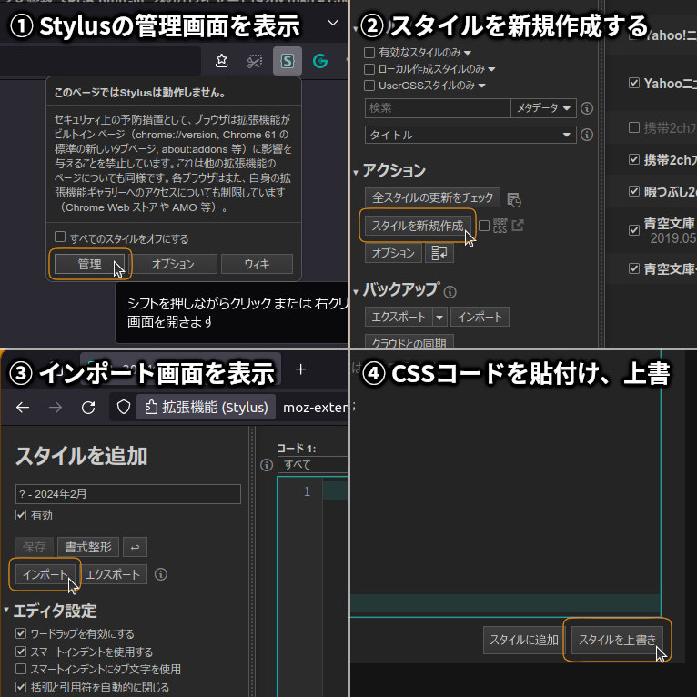

## UserCSS 導入・作成メモ<!-- omit in toc -->

[Home](https://oasis3855.github.io/webpage/) > [Software](https://oasis3855.github.io/webpage/software/index.html) > [Software Download](https://oasis3855.github.io/webpage/software/software-download.html) > [userstyles](../README.md) > ***HowTo.md*** (this page)

<br />
<br />

- [スタイルCSSの公式ドキュメント](#スタイルcssの公式ドキュメント)
- [スタイルCSS の手動インストール方法](#スタイルcss-の手動インストール方法)
- [スタイルCSSをStylusと連携して自動インストールする方法](#スタイルcssをstylusと連携して自動インストールする方法)
  - [ファイルの拡張子](#ファイルの拡張子)
  - [Webドキュメントにインストールボタンを設置](#webドキュメントにインストールボタンを設置)
  - [CSS先頭に記述するメタデータ](#css先頭に記述するメタデータ)

<br />
<br />


## スタイルCSSの公式ドキュメント

CSSファイルの構文（stylus連携・管理機能） ： [Writing UserCSS](https://github.com/openstyles/stylus/wiki/Writing-UserCSS)


CSSファイルの構文（一般的なCSS文法） ： [Writing styles](https://github.com/openstyles/stylus/wiki/Writing-styles)

<br />
<br />

## スタイルCSS の手動インストール方法

- ブラウザの拡張機能stylusアイコンをクリックし、「管理」ボタンをクリックして管理画面を表示
- 「スタイルを新規作成」ボタンをクリックして、スタイルCSSを新規作成する
- 「インポート」ボタンをクリックして、スタイルCSSインポート入力ダイアログを表示
- スタイルCSS（テキスト）を貼り付けて、「スタイルを上書き」ボタンをクリック



<br />
<br />

## スタイルCSSをStylusと連携して自動インストールする方法

### ファイルの拡張子

スタイルCSSの拡張子は .user.css とすること。

> Don't forget that the file must end in .user.css otherwise Stylus won't recognize it as such.

### Webドキュメントにインストールボタンを設置

[](Filename.user.css)

``` [](ファイル名.user.css) ```

GitHubのCSSファイルを参照する場合は、ファイル（RAW表示）へのURLを次のように指定する。

```https://raw.githubusercontent.com/{USER}/{REPO}/main/{Subdir}/{ファイル名}.user.css```

例として…

[https://raw.githubusercontent.com/oasis3855/userstyles/main/Aozorabunko/Aozorabunko_BrownTheme.user.css](https://raw.githubusercontent.com/oasis3855/userstyles/main/Aozorabunko/Aozorabunko_BrownTheme.user.css)

<br />
<br />

### CSS先頭に記述するメタデータ

サンプル例

```
/* ==UserStyle==
@name         スタイルテーマの名称
@namespace    UserNickname_or_URL_and_ThemeName
@version      2024.02.12
@description  スタイルテーマの説明文
@author       UserName
@homepageURL  https://github.com/{USER}/{REPO}
@license      GNU GPL ver2
==/UserStyle== */
```

``` @name ``` ： Stylishのテーマ名として表示される文字列。他のテーマの@nameと重複しても、@namespaceが重複しなければ問題ない。

``` @namespace ``` ： 他のテーマと重複しない内部名称の文字列。空白文字を含んでもよい。

```@version``` ： アップデート チェックで利用される。数字とピリオドのみで構成。

```@homepageURL``` ： Stylusの管理画面で、ホームページへ飛ぶときに利用される

